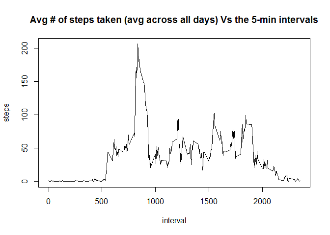

# Reproducible Research: Peer Assessment 1

## Loading and preprocessing the data
Using read.csv to read the file into a data frame followed by producing a clean dataset with no NAs.

```r
## Read the csv file
dat <- read.csv("activity.csv")

## A cleaned dataset with no NAs
clean <- na.omit(dat)

## Set R inline text for numbers to be rounded to 2 decimals
options(scipen = 1, digits = 2)
```

## What is mean total number of steps taken per day?
The question should NOT be confused with 'total number of steps BY date' which would be a plot of x = date, y = steps. Here, we look at PER DAY which is represented by x = total steps per day, y = frequency.

Let's first get the total number of steps in each of the days

```r
## Aggregate the clean dataset using sum of steps by days
aggr <- aggregate(steps ~ date, clean, sum)
```

Plot the histogram for total number of steps taken per day

```r
## Plot the histogram of 'total steps taken per day'
with(aggr, hist(steps, breaks=seq(0,24000,3000), xlim=c(0,25000), ylim=c(0,20), main="Total number of steps taken each day"))
```

 

```r
## Report the mean and median, rounded to an integer since we cannot have fraction of a step.
rep.mean <- round(mean(aggr$steps), 0)
rep.median <- median(aggr$steps)
```
### Answer  
The mean is **10766** steps and median is **10765** steps.

## What is the average daily activity pattern?
First, let's find out the average steps taken for all intervals across all days. Result will be rounded to a full step.

```r
## Aggregate the clean dataset using mean of steps by intervals, rounded to an integer since we cannot have fraction of a step.
aggr2 <- aggregate(steps ~ interval, clean, function(x) round(mean(x),0))
```

Plot the time series line graph of interval against average steps

```r
## Plot the time series line graph of 'average steps taken per interval'
with(aggr2, plot(interval, steps, type='l', main="Avg # of steps taken (avg across all days) Vs the 5-min intervals"))
```

 

```r
## Report which 5-minute interval on average across all days contains the maximum number of steps
max.steps <- with(aggr2, aggr2[steps==max(steps),])
```
### Answer  
The interval of **835** contains the maximum number of steps in average (**206** steps).

## Imputing missing values
### Strategy to fill in missing values
Let's use daily average steps taken for each interval to replace the NAs in the original dataset since we have already obtained the average data.  
The original dataset is duplicated and merged with the data frame with daily average steps taken for each interval by using the 'interval' column as index. This creates an additional column 'steps.y' containing the average values for each interval and the original column 'steps' is renamed as 'steps.x'.  
Next, we copy column 'steps.y' to column 'steps.x' for only rows with NA.

```r
## Duplicate original dataset and merge with data frame (aggr2) containing daily average steps taken for each interval
dat2 <- dat
dat2 <- merge(dat2, aggr2, "interval")

## Copies average values from column 'steps.y' to column 'steps.x' where the row is NA. Renames column 'steps.x' back to 'steps'
dat2$steps.x[is.na(dat2$steps.x)] <- dat2$steps.y[is.na(dat2$steps.x)]
colnames(dat2)[2] <- "steps"
```
Finally, perform the same functions as per the first part. To get the histogram.

```r
## Aggregate the 'dat2' dataset using sum of steps by days
aggr3 <- aggregate(steps ~ date, dat2, sum)

## Plot the histogram of 'total steps taken per day'
with(aggr3, hist(steps, breaks=seq(0,24000,3000), xlim=c(0,25000), ylim=c(0,25), main="Total number of steps taken each day"))
```

 

```r
## Report the mean and median, rounded to an integer since we cannot have fraction of a step.
rep.mean2 <- round(mean(aggr3$steps), 0)
rep.median2 <- median(aggr3$steps)
```
### Answer  
The mean is **10766** steps and median is **10762** steps.  
Based on the histogram, the frequency of mean value increased compared to the previous. For the results, the mean value remains unchanged but the median value changed. 

## Are there differences in activity patterns between weekdays and weekends?
First, add a new column 'wday' that will contain the calendar day of each date. Next, replace the calendar day with the correct indication of either weekday or weekend. Then subset into two data frames 't1' and 't2' containing rows with weekday and weekend respectively. Perform aggregate on 't1' and 't2' by the average steps of each interval. Add the column 'wday' back into each data frame and combine both data frames as 'aggr6'.

```r
## Add 'wday' column containing the calendar day of each date
dat2$wday <- sapply(dat2$date, function(x) weekdays(strptime(x, "%Y-%m-%d")))

## Check and replace calendar day with either "weekday" or "weekend"
dat2$wday <- sapply(dat2$wday, function(x) { if(x=="Saturday"|x=="Sunday") x <- "weekend" else x <- "weekday" })

## Aggregate average steps of each interval on weekday rows
t1 <- subset(dat2, wday=="weekday")
aggr4 <- aggregate(steps ~ interval, t1, function(x) round(mean(x), 0))
aggr4$wday <- "weekday"

## Aggregate average steps of each interval on weekend rows
t2 <- subset(dat2, wday=="weekend")
aggr5 <- aggregate(steps ~ interval, t2, function(x) round(mean(x), 0))
aggr5$wday <- "weekend"

## Combine both data frames back into one
aggr6 <- rbind(aggr4, aggr5)
```
Plot the lattice graph of average steps taken every 5 minute interval across all weekdays and weekends.

```r
## Load the 'lattice' library and plot the graph by weekday and weekend
library(lattice)
aggr6 <- transform(aggr6, wday = factor(wday))
xyplot(steps ~ interval | wday, data=aggr6, type="l", layout=c(1,2))
```

 

### Answer  
There is a slight noticable difference between average steps taken during weekdays and weekends. During weekdays, activity is observed at an earlier interval and lower activity is lesser during working hours intervals. For similarity, both weekdays and weekends have the highest steps taken in the morning interval.
